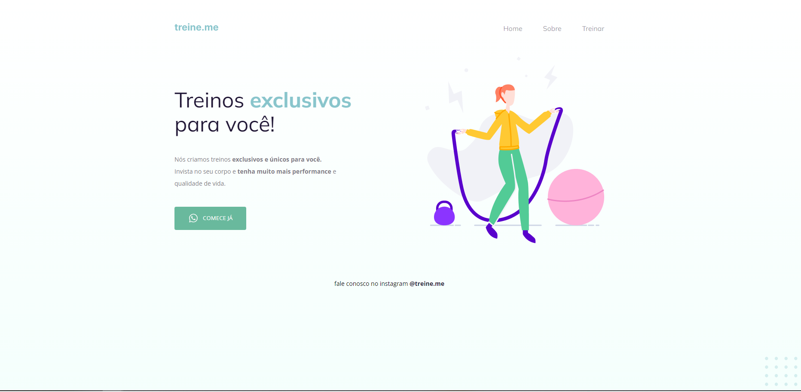

# Projeto02 do curso Explorer da Rocketseat

    
    
    

Treine.me é um projeto de um site estático que oferece treinos exclusivos e únicos para melhorar a performance e qualidade de vida dos usuários.

## :exclamation: Pré-requisitos

Navegador web moderno

## :hammer: Intalação

1. Clone o repositório: git clone https://github.com/Raissa-Cardoso/XR-Projeto02.git
2. Abra o arquivo `index.html` em seu navegador web.

## :computer: Uso

Após abrir o arquivo `index.html` em seu navegador, você verá uma página com informações sobre treinos exclusivos. Explore a página para conhecer mais sobre os serviços oferecidos.

## :star: Tecnologias utilizadas

- **`HTML`**
- **`CSS`**
